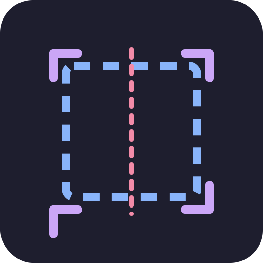

<div style="display: flex; flex-direction: row; gap: 10px"> <h1>Cleave</h1>  </div>


Cleave is a lightweight, GPU-accelerated screen capture tool that allows users to quickly select and copy portions of their screen. Built with Rust and WGPU, it offers smooth performance and minimal resource usage.

## Showcase


## Key Features

- 🚀 GPU-accelerated rendering using WGPU
- 🎯 Interactive screen region selection
- ⌨️ Keyboard-driven controls for precise adjustments
- 📋 Direct-to-clipboard copying
- 🖼️ Support for high DPI displays
- 🎨 Real-time visual feedback during selection

## Quick Start

1. Launch Cleave
2. Click and drag to select a screen region
3. Press `Space` to copy the selection to clipboard
4. Press `Esc` to cancel and exit

## Installation

### From Source

```bash
# Clone the repository
git clone https://github.com/exotik850/cleave.git
cd cleave

# Build and install
cargo install --path .
```
### Linux System Requirements

On Linux, you need to install `libxcb`, `libxrandr`, and `dbus`.

##### Debian/Ubuntu:

```
apt-get install libxcb1 libxrandr2 libdbus-1-3
```

##### Alpine:

```
apk add libxcb libxrandr dbus
```

##### ArchLinux:

```
pacman -S libxcb libxrandr dbus
```

for more details on linux compatibility, [see here](https://github.com/nashaofu/xcap?tab=readme-ov-file#linux-system-requirements)

## Usage

### Keyboard Controls

| Key | Action |
|-----|--------|
| `Space` | Copy selection and exit |
| `Esc` | Cancel and exit |
| `Arrow Keys` | Fine-tune selection |
| `Shift + Arrow Keys` | Adjust selection start point |
| `Ctrl + Arrow Keys` | Move entire selection |
| `Right Click` | Cancel current selection |

### Selection Modes

Cleave offers three selection modes:

1. **Resize Mode** (Default)
   - Use arrow keys to adjust selection size
   
2. **Move Mode** (Hold Ctrl)
   - Move entire selection without changing its size
   
3. **Inverse Resize Mode** (Hold Shift)
   - Adjust selection from the starting point

## Configuration

Cleave uses sensible defaults and currently doesn't require configuration. Future versions may introduce a configuration file for customization.

## Building from Source

### Prerequisites

- Rust 1.82 or higher
- A GPU with Vulkan, Metal, or DirectX 12 support

### Build Instructions

```bash
# Debug build
cargo build

# Release build
cargo build --release
```

## Contributing

Contributions are welcome! Please feel free to submit a Pull Request.

### Development Setup

1. Fork the repository
2. Create your feature branch (`git checkout -b feature/amazing-feature`)
3. Commit your changes (`git commit -m 'Add some amazing feature'`)
4. Push to the branch (`git push origin feature/amazing-feature`)
5. Open a Pull Request

### Code Style

- Follow the Rust standard formatting guidelines
- Use `cargo fmt` before committing
- Ensure `cargo clippy` passes without warnings

## License

This project is licensed under the MIT License - see the [LICENSE](LICENSE) file for details.

## Technical Details

Cleave is built using:

- WGPU for GPU-accelerated rendering
- Winit for window management and event handling
- Image for image processing
- Glam for vector mathematics
- Arboard for clipboard operations
- Xcap for Screen Capture

### System Requirements

- OS: Windows, macOS, or Linux
- GPU: Any GPU supporting Vulkan, Metal, or DirectX 12
- Memory: Minimal (~150-200MB) (WIP!!)

## Acknowledgments

- The WGPU development team
- The Rust community
- Contributors and users who have provided feedback and suggestions
